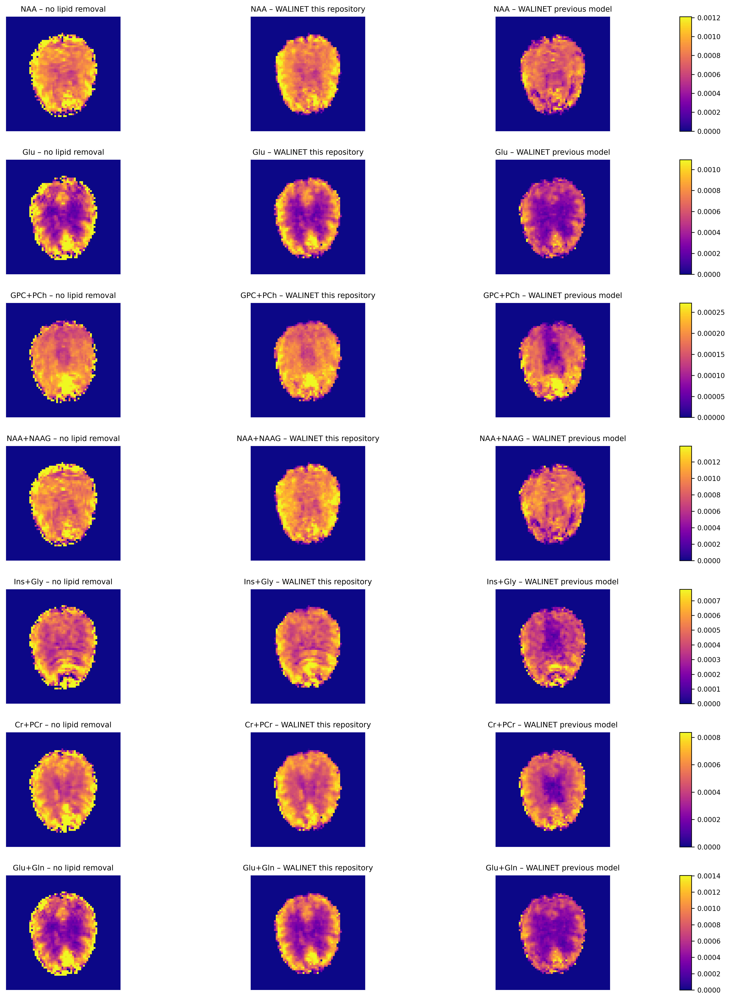

# WALINET - Extended Implementation for 7T Vienna Data

WALINET (Water And Lipid Identification NETwork) is a convolutional neural network designed to remove nuisance water and lipid signals in 1H MR spectroscopic imaging. 

The original method was published in [Weiser et al., 2024](https://doi.org/10.1002/mrm.30402) with source code at https://github.com/weiserjpaul/WALINET.

Although the author retrained the network on Medical University of Vienna 7 T data, the performance remained poor—WALINET did not perform well.

This repository provides a polished, more robust implementation of WALINET tailored to the 7T scanner data in Vienna and similiar systems in Oxford, London and Brisbane, ensuring reliable water / libid removal for these set ups.


## Table of Contents
- [1. Overview](#1-overview)
- [2. Installation](#2-installation)
- [3. Usage](#3-usage)
    - [3.1 Data Requirements](#31-data-requirements)
    - [3.2 Simulations](#32-simulations)
    - [3.3 Training the Network](#33-training-the-network)
    - [3.4 Inference on Unseen Data](#34-inference-on-unseen-data)

- [4. Novelties](#4-novelties)
- [5. Results](#5-results)
- [6. Data used for training so far](#6-data-used-so-far)

## 1. Overview

For full details on WALINET, please refer to the original publication and the README of the original GitHub repository.

This repository makes the minimal adaptations needed to ensure WALINET is robust on the current 7 T setups in Vienna, Oxford, London, and Brisbane, so it can be safely deployed and used on those scanners.

Changes relative to the original code are summarized in [Novelties](#4-novelties). An example result demonstrating these improvements is shown in [Results](#5-results).


## 2. Installation

The easiest way to use this project is via a Docker container.  
All required files and dependencies are located in the `/docker` folder.

**Prerequisite:** Docker must be installed on your system.

1. Build the container:
   ```bash
   bash docker/build_docker.sh
2. Launch the container:
   ```bash
   bash docker/launch_docker.sh

This builds and starts a container with all required dependencies.

## 3. Usage

### 3.1 Data Requirements

Due to permissions, 1H MRSI data cannot be distributed publicly. You must provide your own training and test datasets, placed under the `/data` folder.

Below is an example folder structure and naming convention for a subject (e.g., `sub0`):

```  
/data  
└── sub0  
    ├── OriginalData  
    │   └── data.npy  
    └── masks  
        ├── brain_mask.npy  
        └── lipid_mask.npy  
``` 

- **`/data/sub0/OriginalData/data.npy`**  
  - Contains the MRSI measurements as a NumPy array.  
  - Shape: `(x, y, z, t)`, where `x, y, z` are spatial dimensions and `t` is the FID index.  
  - Data must be complex-valued (dtype `complex64` or similar).

- **`/data/sub0/masks/brain_mask.npy`** and **`/data/sub0/masks/lipid_mask.npy`**  
  - Each is a binary NumPy array (`dtype` `uint8`) of shape `(x, y, z)`.  
  - `brain_mask.npy`: voxels inside the brain = `1`, outside = `0`.  
  - `lipid_mask.npy`: voxels in the scalp/lipid region = `1`, elsewhere = `0`.  

**Note:**  
- The spatial dimensions `(x, y, z)` of the masks must exactly match the first three dimensions of `data.npy`.  
- You can add multiple subject folders under `/data` (e.g., `/data/sub1/`, `/data/sub2/`, etc.), each following the same structure.  


### 3.2 Simulations

#### Water Simulations

The first step in generating training data for WALINET is to extract the water signal from your provided data. Ensure your data is organized as described in [3.1 Data Requirements](#31-data-requirements). For example, if you have two subjects with folders `sub0` and `sub1` under the `/data` directory, follow these steps:

1. Open `src/waterRemoval.py`.
2. Set a version identifier, for example:
   ```
   version = 'v_1.0'
    ```
3. List your subject folders, for example:
    ```
   subjects = ['sub0', 'sub1']
    ```
4. Adjust any basic parameters (e.g., spectral bandwidth) at the top of the script if needed.
5. Run:
    ```
   python3 src/waterRemoval.py
    ```

The script will create two new files in each subject’s /data/subx/OriginalData folder:

- IsolatedWater.npy (containing only the extracted water signal)
- SuppressedWater.npy (the original data with the water signal removed)

#### Lipid and Metabolite Simulations

To generate lipid and metabolite signals, you must first have subject data with extracted water signals, as described in the “Water Simulations” section. 

1. Open `makeTrainDataWat.py` and configure basic simulation parameters (e.g., spectral bandwidth, FID length).
2. Specify which subjects to process by setting:
   ```python
   subjects = ['sub0', 'sub1'] #(thats an example)
   ```
(This follows the same pattern as in the water simulation step.)

3. Run the script:
    
 ```
   python3 makeTrainDataWat.py
```
After execution, each subject folder (e.g., /data/sub0/) will contain a new subdirectory:

```
/data/sub0/TrainData
    └── TrainData_v_1.0.h5
```
Here, v_1.0 corresponds to the version identifier you set in the script. The HDF5 file (.h5) is a dictionary containing:

- spectra: The combined signal (metabolites + water + lipid).

-   lipid: The extracted lipid signal (obtained from the scalp mask after water removal).

-   lipid_projOP: The lipid projection operator.

-   lipid_proj: The lipid projection operator applied to spectra—used as a secondary input to the neural network.

-   metab: The simulated metabolite signals.

-   water: The extracted water signal.

    Note:
    spectra = water + lipid + metab


### 3.3 Training the Network

Before training, ensure you have completed steps **3.1** (Data Requirements) and **3.2** (Simulations). To train a network, follow these steps:

1. **Update `config.py`:**  
   - Set training parameters (e.g., training/validation split, learning rate, batch size).  
   - Choose a model name (e.g., `model_0`). This name creates a new folder at `/models/model_0`, containing:  
     - `loss.txt`: Training and validation loss per epoch.  
     - `params.txt`: All hyperparameters used for training.  
     - `model_best.pt`: The checkpoint with the lowest validation error.  
     - `model_last.pt`: The checkpoint from the final epoch.

2. **Launch training:**  
   ```bash
   python3 run.py
   ```
By default, the script runs on CPU. To enable GPU support, open run.py and modify the line:
```
os.environ["CUDA_VISIBLE_DEVICES"] = "2"  # or the GPU ID you prefer
```

Save and rerun python3 run.py.

After training completes, check /models/model_0/ for loss curves and the saved model checkpoints.

### 3.4 Inference on Unseen Data

1. Open the notebook  
   `Evaluate_Model/EvaluateModel_general.ipynb`.

2. In the “Set Parameters” cell at the top:  
   - Set `exp` to the name of your trained model’s folder inside `/models` (e.g., `model_0`).  
   - Set `subject` to the subject folder name inside `/data` (e.g., `sub0`).  

   > **Note:**  
   > - The subject folder must follow the naming conventions from [3.1 Data Requirements](#31-data-requirements).  
   > - Both a scalp mask (`lipid_mask.npy`) and a brain mask (`brain_mask.npy`) must be present for the selected subject.

3. Run all cells in the notebook.  
   - The notebook includes visualizations that compare the data before and after applying WALINET.  
   - Once execution is complete, the denoised data (with water and lipid removed), in the same format as your input, is stored in the variable `Nuisance_Free_FID_Data`.


## 4. Novelties

- Proper scalp mask integration
- Network Adaptation for increased depth
- simulation parameter adapation
- current data usage
- Lipid Operator convergence fix
- Training time reduction - Avoid worker stuff
- docker installation

## 5. Results

The figure below compares metabolic maps from LCModel fits for key metabolites under three conditions:

- **Left column:** LCModel fit on raw data (with water and lipid signals intact).  
- **Middle column:** LCModel fit after applying our adapted WALINET (this repository).  
- **Right column:** LCModel fit after applying the Vienna-retrained WALINET (original authors).

In the right column, the retrained model often removes too much signal, leading to a loss in the central brain region. In contrast, our updated model (middle) removes nuisance signals while preserving metabolite signal intensity throughout the brain.




## 6. Data Used So Far

# Data from Vienna (current data)

The following datasets were provided by Bernhard Strasser, acquired on the 7 T scanner at the Medical University of Vienna:

/ceph/mri.meduniwien.ac.at/departments/radiology/mrsbrain/home/bstrasser/Projects/Project9_ImplementRecoInICE/Step2_ISMRMAbstractOnPipeline/LargeData_d3hj/Results/Vol[VolNo]/Vol[VolNo]_64x64x35_DICOM_Ice73/CombinedCSI.mat


- Available volumes: `Vol5`, `Vol6`, `Vol7`, `Vol8`

In addition, Zeinab provided one more subject (measured under the same conditions), corresponding to:

/ceph/mri.meduniwien.ac.at/departments/radiology/mrsbrain/home/zeftekhari/Bernhard_pipeline/Results/Vol9/Vol9_DICOM_NoL2/CombinedCSI.mat

# Data from Vienna that Paul used (~2019)

This data was used by Paul and has different FID length (960 instead of 840) then the rest of the data, and the bandwidth was slightly higher. It should not be used for training anymore.

Paul Train data:
/ceph/mri.meduniwien.ac.at/departments/radiology/mrsbrain/lab/Process_Results/3DMRSIMAP_Volunteers/PaulTrainData

# Data from Brisbane

Vol1:
/ceph/mri.meduniwien.ac.at/departments/radiology/mrsbrain/home/zeftekhari/Brisbane_Data/Results/MRSI-TEST-2/DICOM_NoL2/

Vol2: # Zeinab said that the quality of this one i snot so high. I double checked, this is good enough to use for WALINET training!
 /ceph/mri.meduniwien.ac.at/departments/radiology/mrsbrain/home/zeftekhari/Brisbane_Data/Results/MRSI-TEST-1/DICOM_NoL2/CombinedCSI.mat

Vol3:
/ceph/mri.meduniwien.ac.at/departments/radiology/mrsbrain/home/zeftekhari/Brisbane_Data/Results/MRSI-TEST-3/run-1-DICOM_NoL2/

Vol4:
/ceph/mri.meduniwien.ac.at/departments/radiology/mrsbrain/home/zeftekhari/Brisbane_Data/Results/MRSI-TEST-4/run-1-DICOM_NoL2/

Vol5:
/ceph/mri.meduniwien.ac.at/departments/radiology/mrsbrain/home/zeftekhari/Brisbane_Data/Results/MRSI-TEST-5/DICOM_NoL2/

# Date Versions:

1.0 Water peaks up to 110 times higher than metabos
1.1 Water peaks up to 300 times higher than metabos


